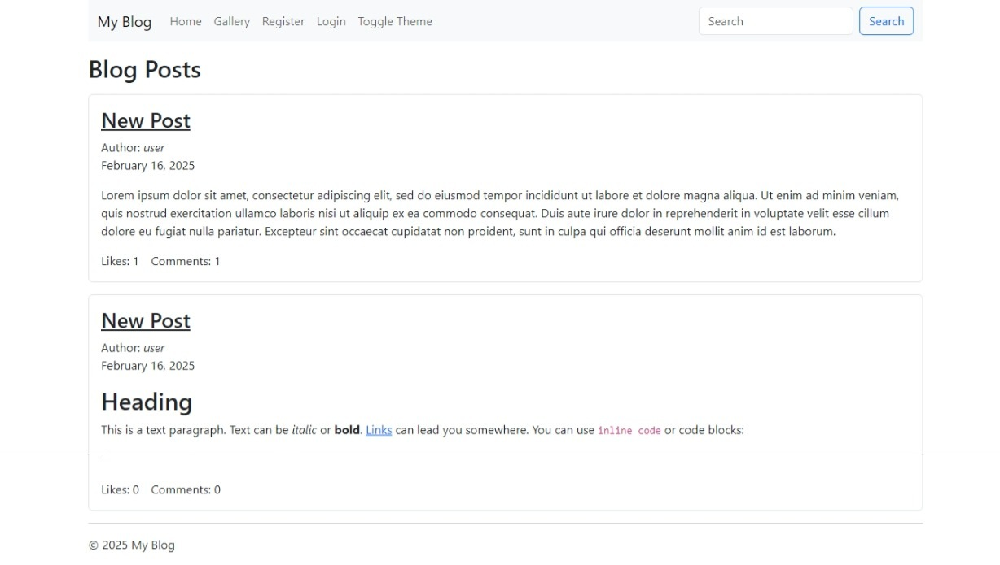
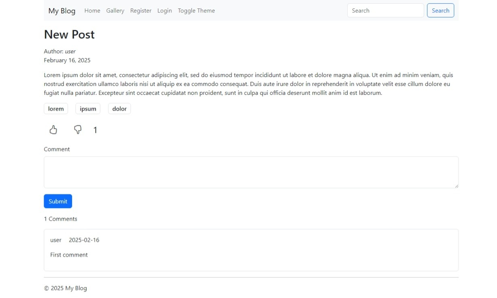
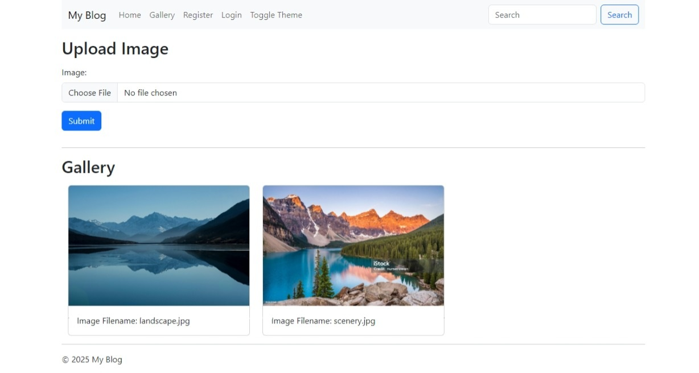
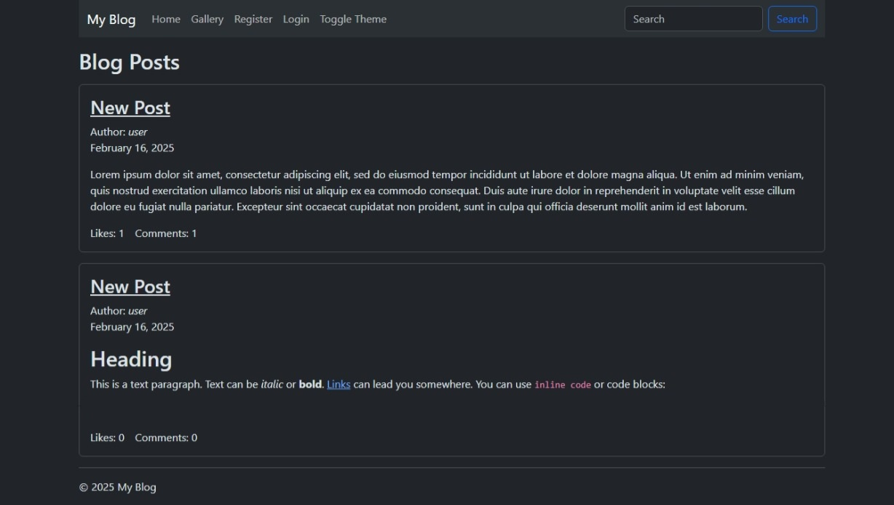

# Blog application written in Go

This is a blog application written in golang. It uses pure `net/http` for the backend (and contains 6K lines of code, most of which is error checking). The application consists of three layers:

- [database package](db) which contains all operations related to the database
- [API package](api) which contains CRUD JSON API for interaction with the app
- [web interface](web) which is a wrapper around API

API uses JWT token for authentication and JSON as data format. Web interface uses [bootstrap](https://getbootstrap.com/) for the frontend, and [htmx](https://htmx.org/) for AJAX.

## Features

- Authentication (registration, login)
- Post management (creation, updating, deletion)
- Like / dislike a post
- Comments (with editing and deletion)
- Tags with post filtering
- Search box
- Image uploading
- Markdown post formatting
- Smooth UI with Bootstrap
- Theme toggling
- AJAX for likes, comments and images
- Swagger API documentation
- Thorough testing for database and API

## How to build

Dependencies:

- [Golang](http://go.dev)
- GCC for sqlite3 driver. On windows, you can download it from [MSYS2](https://www.msys2.org/), or use [WSL](https://learn.microsoft.com/en-us/windows/wsl/install) if you prefer it more. You can also change the driver to eliminate this dependency. It should not be too hard if you know what you're doing.

You can build this application just like any other golang app:

```bash
git clone https://github.com/silentstranger5/blog-app
cd go-blog
go build .
```

## How to use

Before you start, initialize the application. You can also use this option to reset the application state (remove all data and start from the clean slate):

```bash
./blog -init
```

You can modify configuration parameters using command-line arguments. You can learn about them like so:

```bash
./blog -help
```

Finally, you can start the application like this:

```bash
./blog -ip "localhost" -port "8080" -secret "secret" -dbfile "blog.db"
```

All of those arguments are optional and only present to show you how to control the application.

## How to test

You can test this application using `go test` tool. All test packages are located in the `test` directory.

```bash
go test blog/test/...
```

Notice the trailing dot. This is a special syntax that tells the testing tool to recursively check subdirectories.

## Documentation

You can browse an API documentation at `/swagger`. Some details may be inaccurate, so in case of a doubt, check the source code.

## Images

You can upload images to use them in the blog posts. You can see and use images uploaded by anyone, but you can remove only images that you uploaded. You can use Markdown formatting to include images in your posts. Image filenames are specified under the image preview in the gallery section. In order to use them, link to a full path of the image: `/web/static/images/{filename}`.

## Screenshots




